# Session 1: Introduction to Machine Learning and Neural Networks

## 	*You can approximate anything, as long as you have enough terms*
_Just keep this statement in mind, it will make sense as we continue._

## What will we cover

[1. Introduction to Machine Learning](#1-introduction-to-machine-learning)

[2. Single-Neuron Neural Network](#2-single-neuron-neural-network)

[3. Approximating a linear function with Single-Neuron Neural Network](#3-approximating-a-linear-function-with-single-neuron-neural-network)

[4. Approximating a quadratic function with Neural Network](#4-approximating-a-quadratic-function-with-neural-network)

[5. Assignment (XOR)](#5-assignment-xor)


## 1. Introduction to Machine Learning

Machine Learning, Artificial Intelligence, and Augmented Intelligence are words we hear today everywhere. We each perceive them differently: they scare some and excite others. But what is it really? Should we be scared or excited? What can it do for you, your company, and your community?

As a software developer, not a data scientist or a researcher, should you care?
The answer is: you definitely should care. The transformation is happening as you read this. Examples of this transformation are all around us. Luckily, it's not too late to get your feet wet and apply it. The topic's not as scary as it might sound! You don't need a Ph.D. or an advanced degree in statistics (though it does not hurt to have one of them or both :) ).

Let’s start simple. What is the difference between machine learning and our typical day to day software development (I might even say compared to classic development)? In typical programming we receive an input, and we write code that represents all the rules for producing the correct output.


<p align="center"> 
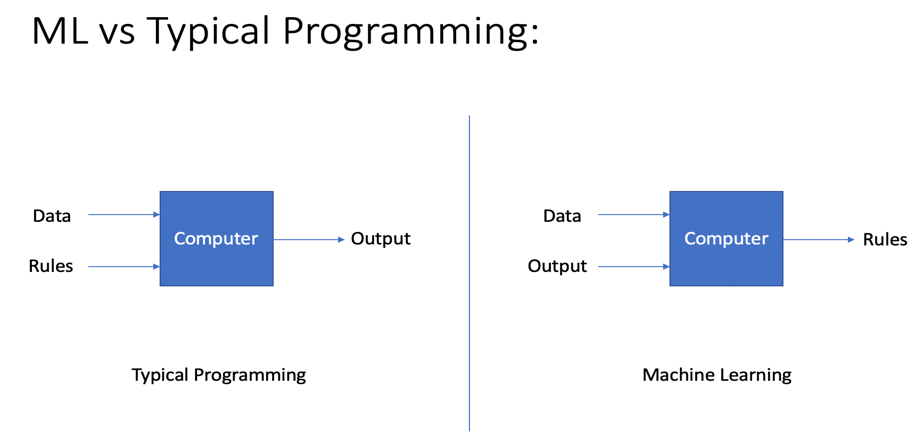
</p>

Although this sounds straightforward, there are many tasks where it is really hard and/or time-consuming to come up with all the rules required to produce the correct output. For example, consider the task of writing a program to determine whether a picture is that of a dog or a cat.

<p align="center"> 

</p>

Try to think of the rules we need to perform this task. Coding the rules aside, simply imagining all of the required rules is quite hard.
On the other hand, in a machine learning paradigm you begin with some input data and the correct output data, and the machine learning algorithm comes up with the rules for you.


If you think about it, it is much easier this way (given you have enough data to cover the whole problem space), as the system is coming up with all the rules for you. Furthermore, it's possible that the algorithm will come up with rules you didn't know existed. These rules are captured in what we call the machine learning model.

## 2. Single-Neuron Neural Network

Usually the first concept that comes to mind when someone mentions Machine Learning or Deep Learning is Neural Networks. They've existed for a very long time, with their good days and bad days :) , but regardless, understanding the basics will allow us to understand the more sophisticated topics we will handle in later sessions.

This figure shows the simplest Neural Network we can create. It has only one node (neuron), accepts 2 inputs and has one output:

<p align="center"> 
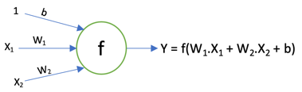
</p>

`Y`:The  output of the neuron, calculated as a function of the sum on inputs multiplied by weight plus the bias: 
<p align="center">Y = f(W<sub>1</sub>.X<sub>1</sub> + W<sub>2</sub>.X<sub>2</sub> + b)</p>

`b`: The bias, allows the network to find a good constant value to add to the input of the neuron.

`X`<sub>`n`</sub>: The input to the network (eg. I am trying to build a network that predict house price based on Number of rooms and total area of the house, then I have 2 numerical inputs: one for number of bedrooms and one for area)

`W`<sub>`n`</sub>: The weight of each input to our neuron; this starts as a random number but with the magic of machine learning (training) the system will be able to to adjust it to be the suitable value to produce the correct output.

`f`: The activation function, this function plays an important role, specifically for nonlinearity. Let’s set `f` to the identity function `f(x) = x`, then `Y` will be:
<p align="center">Y = W<sub>1</sub>.X<sub>1</sub> + W<sub>2</sub>.X<sub>2</sub> + b</p>

Given that `W` is just a floating-point number, then `Y` is just a linear function of the input. In real-life scenarios it's not common to be able to represent cases as a linear function. In reality, most of the time it is a nonlinear function, this is why we need to set function `f`.

### Activation Functions

_Note that these functions can take any real number as input._

**Sigmoid:** The output of sigmoid is a value between 0 and 1.
<p align="center"> 
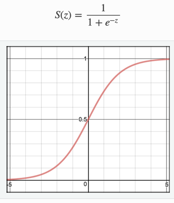
</p>

**tanh:** The output is a value is between -1 and 1.
<p align="center"> 
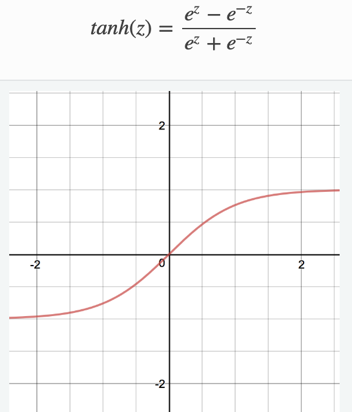
</p>

**Relu:** The output is Max(0,x), provides the same non-linearity as sigmoid but with [better performance]().
<p align="center"> 

</p>

### Training

We now know what a Single-Neuron Neural Network is, and how it calculates its output. Now the question is: how can it find the right values for `W`<sub>`n`</sub> and `b` to produce the desired output?

The process of finding the correct values for `W`<sub>`n`</sub> and `b` is called training. That's because it's an iterative process:

1. The system starts with random values for `W`<sub>`n`</sub> and `b`.
2. Find the `Y(s)` values for our training `X(s)` values.
3. Measure the error value using the calculated `Y(s)` and the expected `Y(s)`.
4. Use what is called an optimization function to update `W`<sub>`n`</sub> and ` b`.
5. Start over again using the new `W`<sub>`n`</sub> values.

### Loss Functions
Loss functions measure how well our model works on the given training data. It's a positive number and the lower it is, the better we modeled our sample data. There are many types of loss functions, to list a few:

**Mean Square Error (MSE):** Widely used in linear regression, outliers drastically affect it.
<p align="center"> 
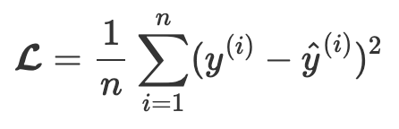
</p>

**Mean Square Logarithmic Error (MSLE):** Treats small differences between small true and predicted values approximately the same as big differences between large true and predicted values.
<p align="center"> 
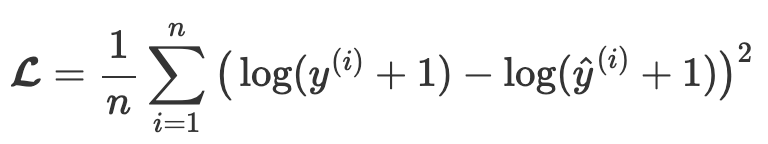
</p>

**Cross Entropy:** Cross Entropy is commonly-used in binary classification
<p align="center"> 
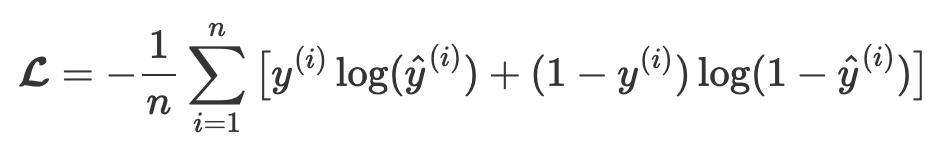
</p>

### Optimization function(s)

Optimization functions are used minimize the loss of the Neural Network; there are many types of optimization functions.

**Stochastic gradient descent(SGD):** Works well for shallow networks. Can cause the objective function to fluctuate heavily

**Adaptive Moment Estimation (Adam):** Computes adaptive learning rates for each parameter. Adam works well in practice and compares favorably to other adaptive learning-method algorithms

## 3. Approximating a linear function with Single-Neuron Neural Network

We saw what Single-Neuron NN looks like, now how can we use it to do a simple task?  

We are going to use Python and Keras to show how we can build our first Neural Network; it is going to be a Single-Neuron NN and we will use it to approximate the following linear function:

<p align="center">Y = 2X - 3</p> 

This function has one input (`X`), and produces one output (`Y`).
Let's build a Neural Network that has only one neuron, and accepts one input.

```python
from tensorflow.keras.layers import Dense
from tensorflow.keras.models import Sequential

# creates our empty model then we start adding our neurons to it
model = Sequential();

# Dense is the type of layer we are adding.
# For now, don't worry about what layers are, we will explain soon!
# The most important thing is the units and input_dim parameters.
# This means we have only one neuron that accepts only one input.
model.add(Dense(units=1,input_dim=1))

# Build our model and setting which optimizer we will use and which loss function 
model.compile(optimizer="sgd", loss = "mean_squared_error")
```

Our model is ready to be trained, but first we need to prepare our training data. The training data will be 2 arrays: one representing `X` and one representing the expected output for each of the `X`s.

```python
import numpy as np

# simple function Y = 2X - 3
xs = np.array([-1, 0, 1,2,3,4],dtype=float)
ys = np.array([-5,-3,-1,1,3,5],dtype=float)
```
We are using the python library numpy to create arrays representing our training data `x`s and `y`s.

Now that we have the training data and the model, we can start training our model! 🎉

```python
model.fit(xs, ys,epochs=500)
```

We pass the `fit` function the training samples and the `epochs` parameter (to indicate how many iterations should be attempted before stopping the training). In this case we are telling it to try for 500 iterations. The fit function can now start the training process.

When you run the code samples from above, you should see an output similar to this:

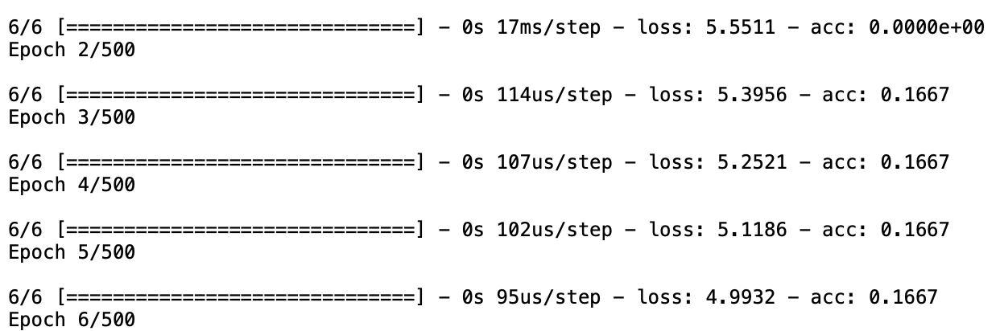  

By the time you reach epoch 500, the accuracy should be 1, which means the model is 100% accurate!

Let's try our model with some value it hasn't seen before:

```python
print(model.predict([10.0]))
```
You will get a result very close to 17, which is 2*10 - 3. This means that the very simple neural net we created managed to approximate the function correctly, by just seeing few sample input and output.

To confirm this, let's print out the weight and bias:

 ```python
weights = model.layers[0].get_weights()[0]
bias = model.layers[0].get_weights()[1]
print("W1 = {0}".format(weights))
print("b = {0}".format(bias))
```
The output I got was:
```
W1 = [[1.9932328]]
b = [-2.9790196]
```
Remember that for our Single-Neuron (that uses identity activation)
<p align="center"> Y = W<sub>1</sub>.X<sub>1</sub> + b </p>

if we replace W1 and b with the values we got we find that  

<p align="center">Y = 1.99*X - 2.979 </p> 

which is a pretty close approximation for our function

<p align="center">Y = 2*X - 3 </p> 


## 4. Approximating a quadratic function with Neural Network

In the last section we saw how to approximate the linear function Y = 2X - 3 , but this is too simple , what if we want to approximate a more complex function, let say quadratic function like this: 

<p align="center">Y = X<sup>2</sup> </p> 

Let's modify our code so Xs and Ys to reflect the new function  

```python
xs = np.random.choice(np.arange(-3,3,.01),500)
ys = xs**2
```

we will leave every thing else the same, and let's re-run our training and see what we get ?

Your will notice that the loss value does not really improve, and the accuracy is 0, basically the model is failing to approximate the function 

screenshot of the training output

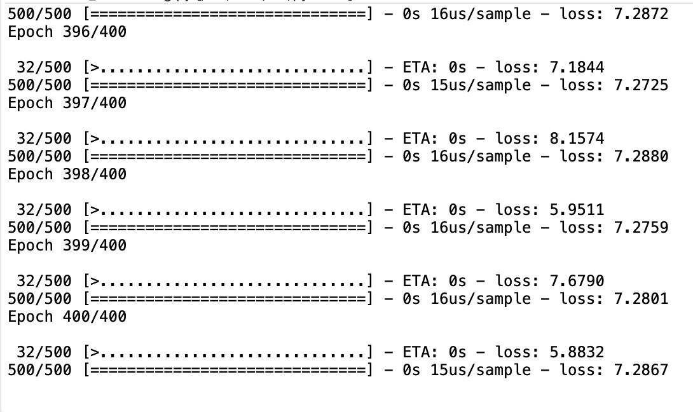

wee can visualize the approximation our model did vs, the expected values using this code 


```python
import matplotlib.pyplot as plt
x_test=np.linspace(-1,1,100)
y_test=x_test**2
results = model.predict(x_test)
plt.plot(x_test,results,c='r')
plt.plot(x_test,y_test,c='b')
plt.show()
```
In the previous code we are plotting the correct results as blue and plotting the model approximation as red, the output will look like this 

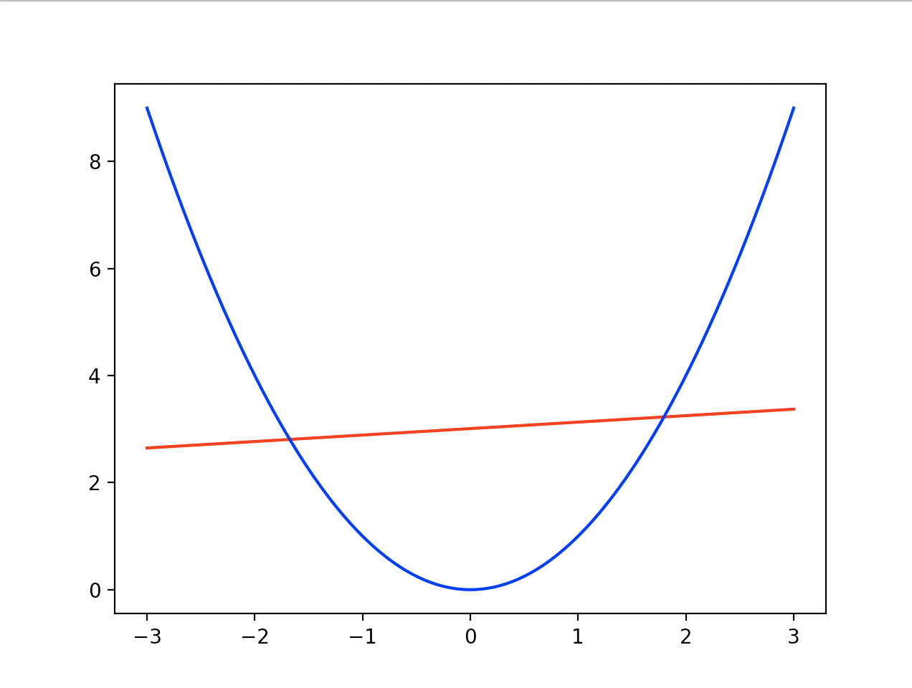
 
I think we can agree this is a very bad approximation.

The reason this is failing is the fact that we are using a single neuron model, which can only approximate linear function, remember with wiungle neurom the output is:

`Y`:The  output of the neuron, calculated as a function of the sum on inputs multiplied by weight plus the bias: 
<p align="center">Y = f(W<sub>1</sub>.X<sub>1</sub> + W<sub>2</sub>.X<sub>2</sub> + b)</p>

The solution to this is Multi-Neuron model, which is not a big difference from what we discussed before the only difference is that we will have more than one neuron and connect all of them together like in the following image

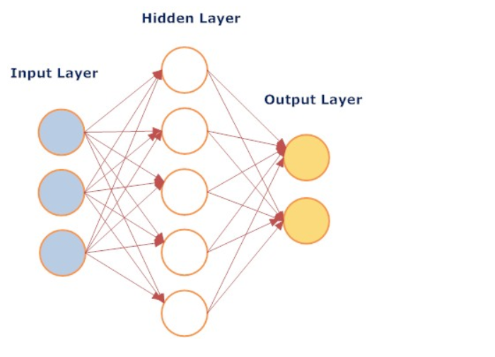

every thing we discussed in the single neuron discussion is still the same, the only difference is that we have now more than one neuron and we use the output of each neuron as an input to our output neuron 

in the diagram we introduced few new terms because of the nature of the Multi-Neuron model


### input layer
   This is the collection of all the input nodes in our model, in our examples so far the input layer contained only one node 
   
### hidden layer
   This is the collection of the nodes between the input and output, in this example we have have one hidden layer with 4 nodes, a neural network model can have more than one hidden layer.

### output layer
   This is the collection of all the output nodes, in our examples so far we only had one output node

let's apply this to our quadratic example, so instead of using a single neuron let have a model setup[ like this 
input layer: 1 node
hidden layers: i hidden layer contains 20 nodes, and activation function of type Relu
output layer: 1 node

replace the model code we had initially with this code

```python
from tensorflow.keras.layers import Dense
model = Sequential();
model.add(Dense(units=20,input_dim=1, activation='relu'))
model.add(Dense(units=1))
```
We do not need to change any thing else, re_run the training step, what do you get ?

Unlike last run, now you will see that the loss value is getting down and if we use the plotting code we get much better approximation 

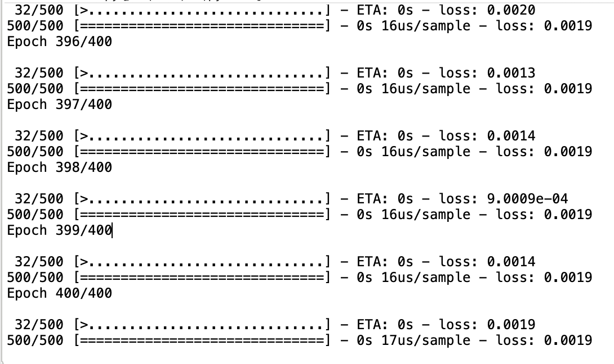
 
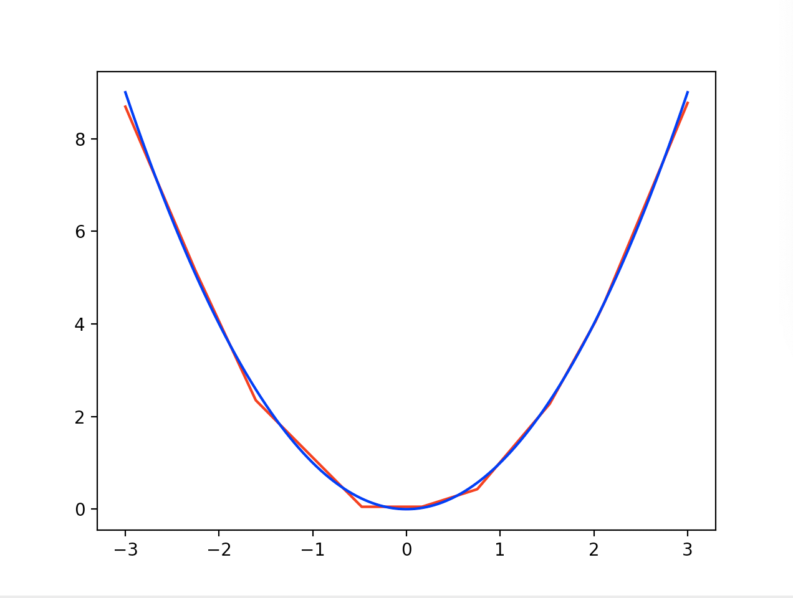

The Layer type we used here is ```Dense``` this is basically a layer that is connected to all nodes in the layers on its left, and right as in the diagram above. There are different types of layers we will see later in this tutorial.

The reason this works much better; is the extra nodes we just added, these nodes allow the model to simulate the non-linearity nature of the function we are trying to approximate

Now you know how to create a single neuron model, or a multi layer model using tensorflow with few lines of code. Hope you found this useful and convince you that machine learning is really easy to get going. This is the end of session one. Hope you give the assignment a try and see you in session 2 

## 5. Assignment (XOR)

   XOR, data for 2 variables looks very simple but it is really none linear. The data will look like that 
   
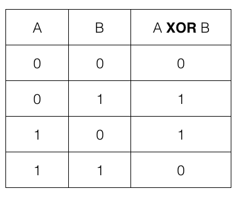 

If we visualize it , it will look like that 
   
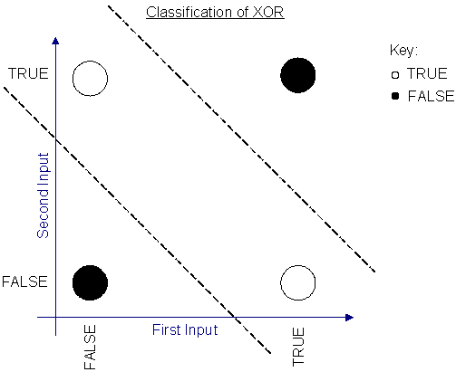

Try to build a model and train it to correctly, generate the correct output for all four possible pairs or input 

```
import numpy as np
from tensorflow.keras.layers import Dense
from tensorflow.keras.models import Sequential


xs = np.array([[0,0],[0,1],[1,0],[1,1]],dtype=float)
ys = np.array([0,1,1,0],dtype=float)


model = Sequential();

## your code goes here


model.compile(optimizer="sgd", loss = "mean_squared_error",metrics=['acc'])

history = model.fit(xs, ys, epochs=1000,verbose=2) 

print(model.predict(xs).round())

```
the expected output should be 
[[0.]
 [1.]
 [1.]
 [0.]]

<a href="https://github.ibm.com/BusinessAnalytics/machine-learning-sessions/blob/master/session-1/ReallySimple/XOR.py">Solution</a> 
   
   