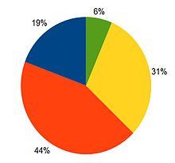
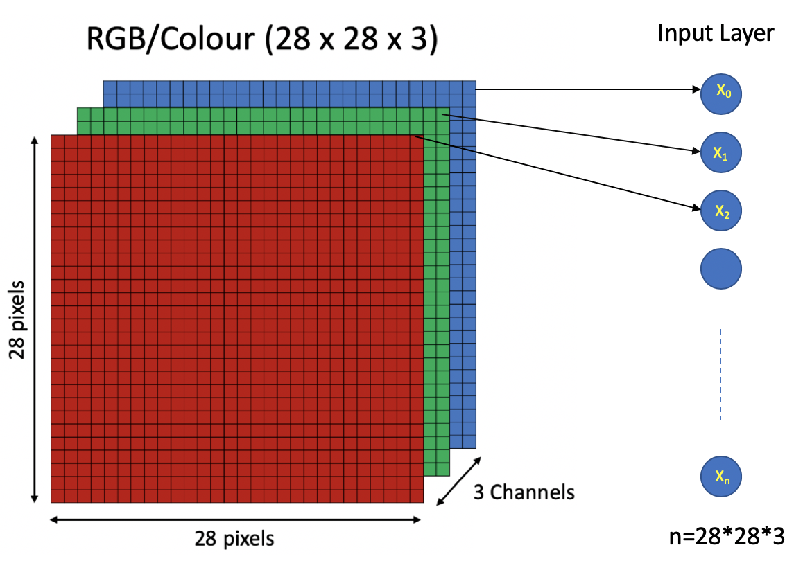
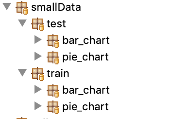
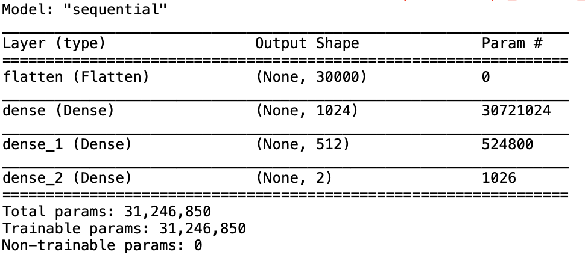
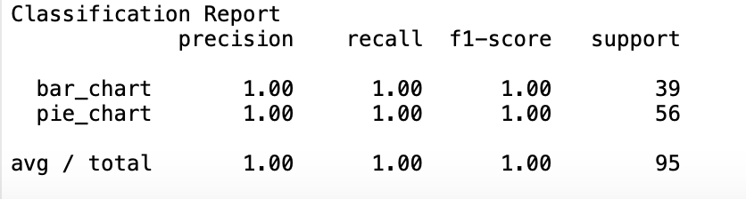
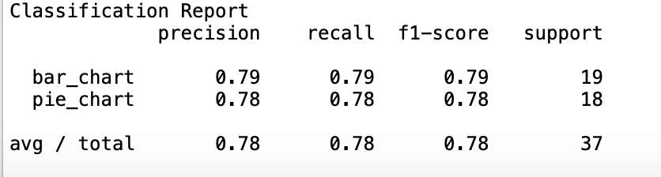
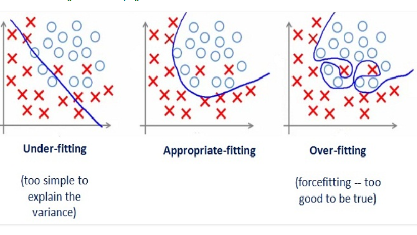
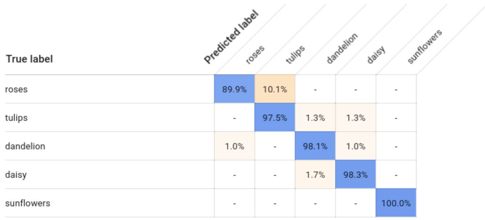
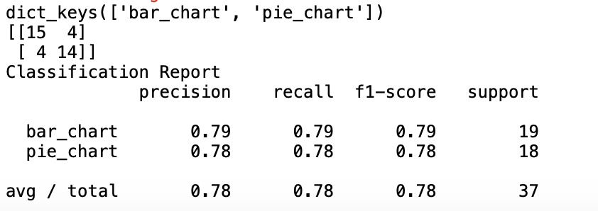

# Session 2: Recognizing chart type from an image

## What will we cover

[1. What are we going to build](#1-what-are-we-going-to-build)

[2. Loading images training set using tensorflow](#2-loading-images-training-set-using-tensorflow)

[3. Designing a Neural network model for chart recognition](#3-designing-a-neural-network-model-for-chart-recognition)

[4. Testing model performance](#4-Testing-model-performance)

[5. Confusion matrix](#5-Confusion-matrix)

[6. Saving the Model](#Saving_Model)

[7. Observations and Conclusions](#Observations_Conclusions)  

## 1. What are we going to build

   In session 1, we saw how to approximate linear and quadratic functions using Neural networks. This was a simple enough project to get introduced to Tensorflow and how to use it to build Neural Network models. Now it is time to move to more fun project, a project that will be very hard (if not impossible to do with classic programming). Let's build a system when given an image of a chart it can tell us what type of chart is in the image for example: 
   If the system receive this image: 

<p align="center"> 

</p>

   It will say this is a bar_chart 
   But if it receive, this image
<p align="center"> 

</p>  
   
   It will say, this is a pie_chart 
   
   The first thing we need to think about is what will be the input to our model, In all the cases we have seen so far the input was quite simple it was either one or 2 simple numbers, but in this case what would it be  ?
   We can not just feed the image as an image to the model for training, we need to represent it as numbers. Easiest way is to basically feed in the pixel values as the input to the model. basically if we have a true colour image we can represent every pixel using 3 integer values to represent the RGB value of the pixel. In other words is our image is W width and H height in pixels, we represent it as W*H*3 numbers. This way we can feed it to the Neural network and start the training process.
   
   The following diagram shows how this will look for an image that is 28 X 28 pixels

<p align="center"> 

</p>    
   
## 2. Loading images training set using tensorflow
   In the last section we discussed how can we present images to a neural network, let talk a bit about training sets and testing sets.
   What we have been doing so far, is called supervised learning, which is training a model by giving it a set of inputs and the expected output this way the model can learn from these input/outputs the rules we need to produce the correct output, These inputs/outputs are called the training set, because it had been used to train the model. But how can we check how good is our model ? 
   
   If we use the same inputs we used for the training, this will not be a correct way to measure the quality of our model, since the model have seen these inputs already and knows what should be the output, this can be used only to measure the training accuracy. But in real use cases the model will receive inputs it did not see before. This Bring us to the testing data set, which is a set of inputs and their output that the model did not see during training. we use this testing dataset to measure the model accuracy to see if it is really able to recognize input it did not see before.
   
   Ok, so we now know we need a training set and testing test. Let's see how we prepare the folders containing our images. We start by creating this folder structure
   


   You will notice that we created separate folders for the training vs testing, and in each folder we created sub folders one for each type of chart we are going to recognize. For example in this case we have samples for bar and pie charts

Next step is to load the images in these folders and prepare to be fed into our model, tensorflow has a great utility called ``ImageDataGenerator``, we can use it to load our data the following code shows how this can be done 

```python
from tensorflow.keras.preprocessing.image import ImageDataGenerator
from tensorflow.keras.applications.mobilenet import preprocess_input

train_data_generator = ImageDataGenerator(preprocessing_function=preprocess_input)
train_generator = train_data_generator.flow_from_directory("../smallData/train",
                                                           batch_size=32,
                                                           target_size=(100,100))
```

What did we do in this code, first step we created the ImageDataGenerator, when you create an ImageDataGenerator you can pass it parameters to control how it work, for example you can pass it a rescale factor that will be multiplied by all pixel values (to make all values range between 0 and 1), you can also pass it a pre-processing function that will be called on all inputs this can be your own function or one of the tensorflow.keras functions, i found that using `` tensorflow.keras.applications.mobilenet.preprocess_input `` function usually produce good results for me, that is why you will find me passing it in the code when i create the image generator.

Then we called the method flow_from_directory to create our train data generator, this method receives the folder to load the images from, target size it will scale the images to fit (in this case we used 100 X 100), and the patch size , the patch size is basically the number of images to be yielded from the generator per batch.

## 3. Designing a Neural network model for chart recognition

   We prepared our training data, now we can go ahead and create the model we will try to train, this will be no different that what we did before in session one with one exception that the model will be a bit bigger (a lot bigger actually)
   
  ```python
from tensorflow.keras.models import Sequential
from tensorflow.keras.layers import Dense, Flatten
from tensorflow.nn import relu,softmax
from tensorflow.keras.optimizers import SGD
model = Sequential()
model.add(Flatten(input_shape=(100,100,3))
model.add(Dense(1024,activation=relu))
model.add(Dense(512,activation=relu))
model.add(Dense(2,activation=softmax))

model.compile(optimizer=SGD(),
               loss='categorical_crossentropy',
               metrics=['accuracy'])
   ```
   
   You will notice that i am using more nodes in each layers than before, and i set my input to be and array or (100,100,3) as we explained before, but neural net Dense layer expects a vector, that is why we use the layer type Flatten which will basically convert our input into a vector
   
   You will also notice that my output layer has 2 nodes since i have 2 classes of output to identify, Bar chart and Pie chart, and the loss function i am using here is the categorical crossentropy since my output is more than one class.
   
   To get an idea how big is this model, use the summary function to display it, like this 
   
   ```python      
 model.summary()
   ```
   The output you will get when you run this code is 
   


as you can see this model, have 31M parameters to train

to train the model use this code 

```python
model.fit_generator(generator=train_generator,epochs=500)
```
   since we are using InageDataGenerator to load our data, we use the fit_generator method instead of the fit method, which is like pretty much like the fit method we saw before but it receives a generator as the input instead of the typical array of input and output. 
   
## 4. Testing model performance

   We loaded our data, designed our model and trained it. Now we want to see how does it perform.

To do this, we need to understand few new terms

**True Positives (TP):** 
   
   These are the correctly predicted positive values which means that the value of actual class is yes and the value of predicted class is also yes. E.g. if actual class value is Bar charts, and predicted class is Bar chart.

**True Negatives (TN):** 
   
   These are the correctly predicted negative values which means that the value of actual class is no and value of predicted class is also no. E.g. if actual class is not a Bar chart and predicted class tells you the same thing.

**False Positives (FP):** 
   
   When actual class is no and predicted class is yes. E.g. if actual class is a Pie chart but predicted class tells you it is a Bar.

**False Negatives (FN):** 
   
   When actual class is yes but predicted class in no. E.g. if actual class is Bar chart but the predicted class is Pie.

**Precision:** 
 
   Precision is the ratio of correctly predicted instances of a class to the total predicted instances of this class. In other words, out of all predicted bar charts how many were really bar charts. High precision indicates a low false positive rate.
   Precision = TP/TP+FP

**Recall:** 

   Recall is the ratio of correctly predicted instances of a class to the all instances of the actual class. In other words out of all bar charts how many were correctly identified. 
   
   Recall = TP/TP+FN


**F1 Score:**  
   
   F1 Score is the weighted average of Precision and Recall. Therefore, this score takes both false positives and false negatives into account. Intuitively it is not as easy to understand as accuracy, but F1 is usually more useful than accuracy, especially if you have an uneven class distribution. Accuracy works best if false positives and false negatives have similar cost. If the cost of false positives and false negatives are very different, it’s better to look at both Precision and Recall.
   
   F1 Score = 2*(Recall * Precision) / (Recall + Precision)
   
This might sound a but much, but the more you use these th emore it will be clear to you, for now lets just focus on the precision

Calculating these numbers, is a task that we  will do many times to verify our models, so it will be a good idea to have a utiltiy method that does that and we can call it any time we need to:
 
```python
   from sklearn.metrics import confusion_matrix, classification_report   
   def test(generator, model):
        predictions = model.predict_generator(generator)
        row_index = predictions.argmax(axis=1)
        print('Classification Report')
        target_names = generator.class_indices.keys()
        print(classification_report(generator.classes, row_index, target_names=target_names))
```
So, in the previous code we create a method that receive a data generator (like the one we created before) and a model then it display the numbers we discussed for each class in the model. 

The First line is just using the model to predict all the values for our testing data by calling ``predict_generator`` on our model and passing it the generator.

Remember that our output layer has 2 nodes (one for each class), this means the prediction we will get back will be an array of n rows where n equals the number of images we are passing to the model and each row will be 2 columns with one float number for each class (the number is basically the probability of the input image being the class), for example for 2 images it might look like this [[0.6 0.1] [0.2 0.8]], we want to convert this to a vector of n where n equals the number of test and the value in each row reflect the index of the predicted class.

Calling the method argmax on the predictions array will do this for us, for example if we call argmax on [[0.6 0.1] [0.2 0.8]] we will get back [0 1]

the last step is to calculate the precision, recall, and F1Score. We do not need to calculate it ourselves, we will use the classification_report function from sklearn module, and it will do all the work for us. This function requires the class , the correct classification, the predicted classification and the names of the classes. We explained how to get thr prediction vector, the correct classification can be obtained from the generator using generator.classes and the labels of the classes using generator.class_indices.keys().

lets call this function now using our training data and see what do we get

```python
   test(generator=train_generator, model=model)
```
you will get this output



As you can see, our training precision is 100%, but as we said it is more important to calcuate these numbers on data set the model did not see before

Lets, create a generator using our testing data

```python
test_data_generator = ImageDataGenerator(preprocessing_function=preprocess_input)
test_generator = test_data_generator.flow_from_directory("../smallData/test",
                                                         target_size=(100,100),
                                                         shuffle=False)
```
it is pretty much similar code to what we did with the training set, but we pass it the folder for the testing set instead of the training one, and we set shuffle to False since we do not want to shuffle or testing set.

now we can call our test function agiann but this time with the testing data set and see what do we get

```python
   test(generator=test_generator, model=model)
```

you will get something similar to this output



You will notice that precision now is 78% instead of 100%, but this is a lot more real measure of our model performance since we are running it on data the model did not see before.

Now, this an interesting observation here, out training precision is 100%, while our testing precision is 78%. Although 78% is good, typically when you see a big difference between model training performance and testing performance this is an indication of a problem called Overfitting

**Overfitting:**
If our model does much better on the training set than on the test set, then we’re likely overfitting. There are few actions you can take to deal with overfitting:
1- Add more samples to your training set
2- Stop your training earlier
3- Remove useless features, for example does color matter in your classification, maybe you shoudl switch to gray scale instead of RGB

<p align="center"> 

</p>   

## 5. Confusion matrix


We checked out model performance, and found that our precision is on average 78%, one important point to keep in mind is when you have a model that do multi-class classifications, looking at the over all performance can be misleading. It is important to check the performance per class as well, this will allow you to see how each class if performance. For example in our case you will notice that the performance of bar chart is 79% while pie chart is 78% this is fine, but imagine is you find one of them like 20% this means you need to pay this class more attention. For example what is the qualility of the samples for this class, do we have enough samples for it and so on.

Another, important aspect to keep in mind when dealing with multiple classes classification, if we find that our model performs bad for one class, it is important to check to see what does it confuse this class with. In other words imagine we were detecting Bar, Pie and Line charts then we find that our model performs bad with line chart classification, it will be very helpful to know what does it confuse line charts with. For example does it tend to misclassify line charts as bar charts, does it tend to think that pie charts are line charts and so on. This helps us alot to decide what acvtions do we need to take to deal with the issue.

This is where the concept of a confusion metrix become very handy. The easiest way to understand confusion matrix is to visualize it:

<p align="center"> 

</p>   

A quick glance at the confusion matrix will allow you to compare the predicted classes to the actually and what classes get misclassified and what was the misclassification. We want the Diagonal to have the heights number since this reflect that predication matched the true class.

The module we used before to print our the precision and F1 score, comes with a handy function for showing the confusion matrix. Here is how we can show our confusion matrix

we will modify out test function we did before to look like this 

```python
	from sklearn.metrics import confusion_matrix, classification_report
	def test(generator, model):
		predictions = model.predict_generator(generator)
        	row_index = predictions.argmax(axis=1)
        	target_names = generator.class_indices.keys()
        	print(target_names)
        	print(confusion_matrix(generator.classes, row_index))
        	print('Classification Report')
        	print(classification_report(generator.classes, row_index, target_names=target_names))
```

The change was very simple, we added 2 lines print statements. One to print the names of all class

```python
target_names = generator.class_indices.keys()
print(target_names)
```
and one that calls the utility to print the confusion matrix

```python
print(confusion_matrix(generator.classes, row_index))
```

this should produce:


 


      