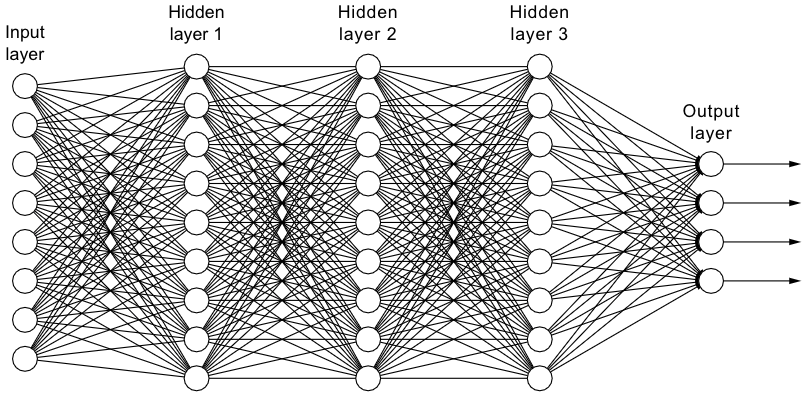
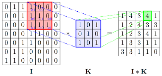
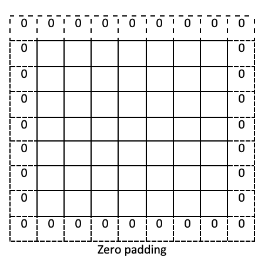
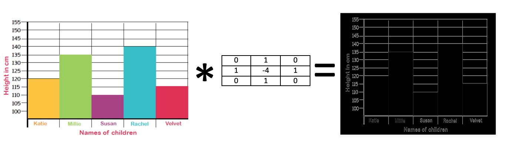
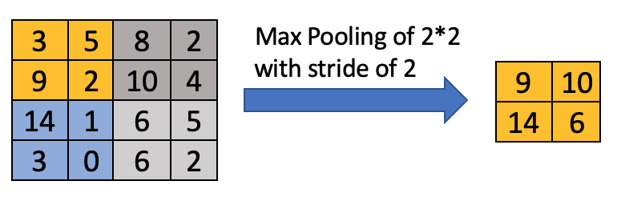

# Session 3: Introduction to Convolutional Neural Network (CNN)

## What will we cover

[1. What is Dense Layer](#1-what-is-dense-layer)

[2. What is Convolutional Neural Network](#2-what-is-convolutional-neural-network)

[3. What is Pooling Layer](#3-what-is-pooling-layer)

[4. Why Convolutional Neural Network](#4-why-convolutional-neural-network)

[5. Using Convolutional Neural Network for chart recognition](#5-using-convolutional-neural-network-for-chart-recognition)

[6. Compare accuracy and model size of the CNN model to the NN modell](#6-compare-accuracy-and-model-size-of-the-cnn-model-to-the-nn-model)

[7. Assignment](#7-assignment)

## 1. What is Dense Layer

We went through how single neuron and multi neuron (multi layers as well) neural networks work, one observation you would have  seen is that layers in neural networks are fully connected. Meaning that every node in one layer is connected to all nodes in the layers before and after it  (Hence the layer type we used in tensorflow is called Dense). 

 

But Why is that important to understand, The fully  connected nature of the Dense layer impacts how many parameters we need to train during the training phase, and it impacts how long training will take and how big it the model. For example if we have neural network that accepts 5 inputs and have 3 hidden layers 10 nodes each and one output layer of 2 nodes. The number of parameters in this networks will be N = 5 \* 10 + 10 \* 10 + 10 \* 10 + 10 \* 2 = 270 (this calculation does not consider the extra B node)

Can we reduce this, so we can create very complex netwroks without having 100s of millions of parameters to train ?!! Welcome to convolution neural networks or CNN

## 2. What is Convolutional Neural Network

Convolution Neural Network is a special kind of neural network that had been proven to work very well with images. For example recognizing faces, animals, different types of objects and so on.  

To understand how CNN works we need to first understand what is the Convolution operation. Convolution operation is applying a specific filter to the image to extract specific feature by considering small squares of the input data and maintain their relationship. Let's assume that our image is I and the Filter is K how can we apply the convolution operation  ?

 

In the figure above, convolution is I\*K the filter K is moved across I one step at a time and for each step that part of I is multiplied by K we keep doign that till the filter had been moved over all pixels in I and we get the output image I*K

You will notice that the output did shrink in width and height, in the example above the input was 7\*7 but the output was 5\*5. There are multiple or parameters that affects the convolution operation, in the previous example we the filter moved one pixel at a time, this is called the stride which you can control to be suitable for your use case. Another factor is do you do padding or not, in the example above the output image shrank because we did not do padding so the corner pixels could nto be convoluted, while we could have added a rectangle of 0's around the image this would have increased the input size to 9\*9 so the output would have been 7\*7

 

The following image will show the the effect of applying a specific convolution filter on an image 

 

This [notebook](https://github.com/mohmiim/MLIntroduction/blob/master/session-3/ImageConv.ipynb "conv sample") contains code showing the effect of the filter on the image, so you can experiment with different values and different images. Some filter values can extract horizontal edges, some extract vertical and so on. 

When we train a convolution Neural Network it try to find the best filters that extract the best features to identify the different classes we are training it to recognize.

In tensorflow to create a convolution layer you use the layer type Conv2D

~~~~{.python}
from tensorflow.keras.layers import Conv2D
model.add(Conv2D(64,(3,3),activation=relu))
~~~~

The previous code add a convolution layer to your model,that contains 64 filters, where each filter is 3\*3 

## 3. What is Pooling Layer

We learned in the previous section what is convolution layer, it extract features from the layer before it. But these features encode the precise position of the feature in the input, this is not ideal since a small shift in the input will result in a different feature set and can lead to wrong classification. The solution to this is to create a lower resolution version of the extracted features while maintaining the large or important features this is called pooling this will remove the precise details this might be of no value to our recognition task. The pooling layer does not really learn it just apply the pooling operation to the prvious layer output, typically in CNN you find each Convolution layer followed by a pooling layer.

There are different types of pooling, for example Average pooling which calculate the average value for the pooling area and this became the output, another type is Max pooling which output the largest value in the pooling area.

Example of max pooling

 

 
 In tensorflow to create a MaxPooling layer you use the layer type MaxPool2D

~~~~{.python}
from tensorflow.keras.layers import MaxPool2D
model.add(MaxPool2D((2,2)))
~~~~

## 4. Why Convolutional Neural Network

One of the main benefits of CNN, is the reduction in the numbers of parameters compared to the similar Dense Layers. This allows us to created much more complex networks and still be able to train them in reasonable amount of time and using reasonable hardware. For example consider a use case where our input is an RGB image of 100 Pixels by 100 pixels, this means our input size is 3\*100\*100 = 30000, LEt see how many parameters would we have if we create a Dense layer of 1000 Node vs Conv layer of 64 filters each filter 3\*3.
Dense : 30000\*1000 = 30000000 Parameters
Conv : 64\*3\*3\*3 = 1728 Parameters. 

The reduction in number of parameters will have big  impact on how long it takes to train the Network, this is huge factor since Machine Learning is an iterative process by nature, the faster it takes to train your network the more iterations and experiment you can do with your network and its parameters which will always lead to a better model.

## 5. Using Convolutional Neural Network for chart recognition

Now we are ready to put it all to work, lets see how can we apply CNN to our chart recognition problem. The change is actually quite easy we will use every thing we learned so far. Training set loading, model training,saving/loading and testing will not change at all. the only change will be the model itself and how we build.  

Replace the model building code we had in session2 with this code

~~~~{.python}
from tensorflow.keras.layers import Dense, Flatten, Conv2D, MaxPool2D
model = Sequential()
model.add(Conv2D(128,(3,3),input_shape=targetSize_withdepth,activation=relu))
model.add(MaxPool2D((2,2)))
model.add(Conv2D(64,(3,3),activation=relu))
model.add(MaxPool2D((2,2)))
model.add(Conv2D(32,(3,3),activation=relu))
model.add(MaxPool2D((2,2)))
model.add(Flatten())
model.add(Dense(512,activation=relu))
model.add(Dense(5,activation='softmax'))
~~~~

The rest of the code should stay pretty much the same, if you check the output of model.summary() you will notice that this model has 1,737,317 parameters, compared to the 31M+ parameters in the model we created in previous session.

This [notebook](https://github.com/mohmiim/MLIntroduction/blob/master/session-3/Session_3_first.ipynb "full example") shows a fully working example

## 6. Compare accuracy and model size of the CNN model to the NN model

Accuracy should be similar for both models if you used the same network architecture as i did in my code, but the big difference should be in the model size, the CNN model size will be around 7MB while the NN model will be 100's of MBs

## 7. Assignment

Can you modify the model to improve the accuracy, give it a try by copying the provided [notebook](https://github.com/mohmiim/MLIntroduction/blob/master/session-3/Session_3_first.ipynb "full example") and modfying it. Good luck

