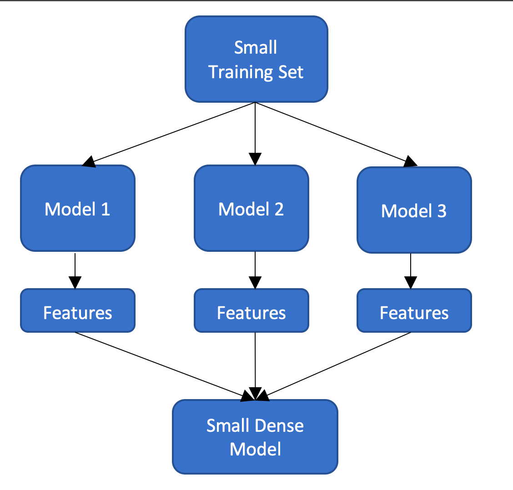

# Session Ensemble 

## What will we cover

[1. Accuracy so far and how to improve it](#1-accuracy-so-far-and-how-to-improve-it)

[2. Using multiple models architecture](#2-using-multiple-models-architecture)

[3. Assignment](#3-assignment)

## 1. Accuracy so far and how to improve it

So far we managed to get our accuracy in the 90% range, without adding more samples. but can we even do better :)

We found that if we apply transfer learning and use a pre-trained model it improved our accuracy quite a bit. Can we do more, what if we used 2 or 5 models to extract the features, will it make it better ?!

Let's try it

## 2. Using multiple models architecture

How can we use multiple models to extract the features use all these features combined to train our small dense model. The following Diagram shows the general fllow

 

Here is an example, of loading and extracting features from 2 models then combining them  

- Loading the first model 

~~~~{.python}
FEATURE_EXTRACTOR1 = xception.Xception(weights='imagenet',include_top=False,input_shape=targetSize_withdepth)
model1 = Sequential()
model1.add(FEATURE_EXTRACTOR1)
model1.add(Flatten())
~~~~

Notice that we added a Flatten layer to the end of the feature extractor model to make the output a vector

- Loading the second model 

~~~~{.python}
FEATURE_EXTRACTOR2 = resnet_v2.ResNet152V2(weights='imagenet',include_top=False,input_shape=targetSize_withdepth)
model2 = Sequential()
model2.add(FEATURE_EXTRACTOR2)
model2.add(Flatten())
~~~~

- Extracting first features set

~~~~{.python}
features_x1 = model1.predict_generator(train_generator)
~~~~

- Extracting second feature set

~~~~{.python}
features_x2 = model2.predict_generator(train_generator)
~~~~

- Combining all features into one feature vector

~~~~{.python}
all_features = np.concatenate((features_x1,features_x2), axis=1)
~~~~

the rest will be the same as in session 4 but we will use the all_features vector as our training sample. 

Then lets re-train our model and run the tests, what do you find ?

This [Notebook](https://github.com/mohmiim/MLIntroduction/blob/master/session-5/Session_5_ensemble.ipynb) has the full code.

## 3. Assignment

Can you try different model combinations to produce better results ? 

