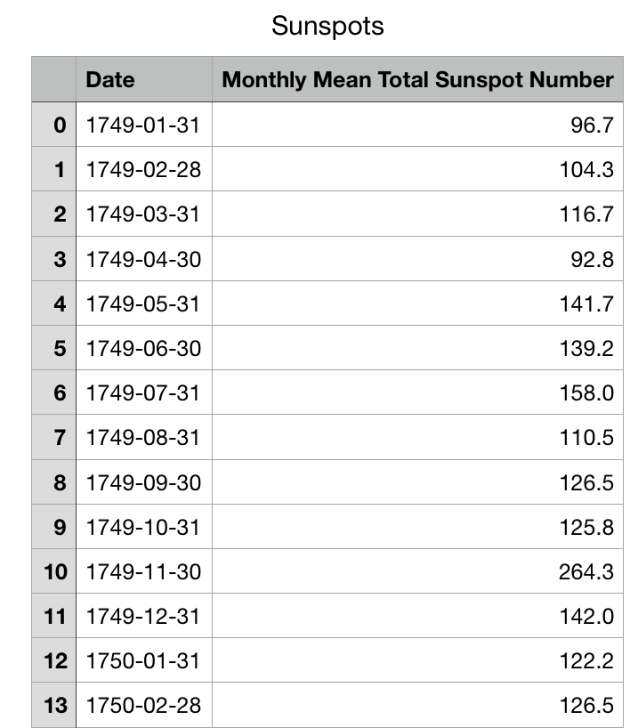
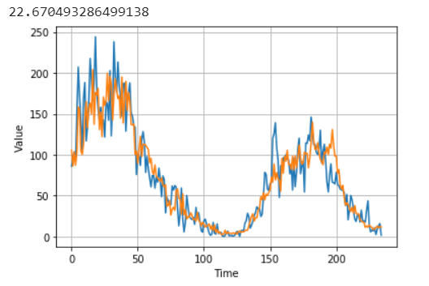

# Introduction to time series forecasting with deeplearning 

## What will we cover

[1. What is Forecasting](#1-what-is-forecasting)

[2. Goal of the session](#2-goal-of-the-session)

[3. Time series attributes](#3-time-series-attributes)

[4. Sequence Models](#4-sequence-models)

[5. Picking our dataset](#5-picking-our-dataset)

[6. Prepare Data for training Tensorflow model](#6-prepare-data-for-training-tensorflow-model)

[7. Design our Tensorflow model](#7-design-our-tensorflow-model)

[8. Univariate single step forecasting ](#8-univariate-single-step-forecasting)

[9. Conclusion](#9-conclusion)

## 1. What is Forecasting

Forecasting, is the act of using historical data as an input to learn and make predictions about the direction of future trends. 
Formal definition if Y = {y1,y2, .... yn}then forecasting is finding the values of yn+h where h is the horizon of the forecast
It is important to keep in mind that it is important to know what type of forecasting you are trying to do  
**Univariate time Series:** where only one variable is changing over time, for example if we have a sensor recording temperature over time   
**Multivariate time series:** more than one variable is changing over time, for example accelerometer where X,Y and Z are recorded over time 

## 2. Goal of the session

Our goal is to show how can we build a deeplearning model to do forecasting of Multivariate time series?. I will not get in the discussion about deeplearning VS classical statistics for time series forecasting. Quick search will show that it is being debated even for univariate time series with papers supporting both sides, so i will leave that to you as a self reading after you finish the tutorial 

## 3. Time series Attributes

Before we jump into the Machine Learning aspect of this tutorial it is important to make sure we understand few basic attributes of time series  

**trend:** a systematic linear or nonlinear component that changes over time and does not repeat  

 

**Seasonality:** a systematic linear or nonlinear component that changes over time and repeat  

 

In real life data you will find both trend and seasonality together

 

**Noise:** non-systematic component that is neither trend nor seasonal

 

Typical time series will contain all three

 

## 4. Sequence Models

Time to start talk Machine Learning, In the previous sessions we did learn many types of Machine learning layers and models, like Neural Networks and Convolution Neural Networks (CNN). Time series will require us to learn a new type or Models which is called sequence models. The name almost till it all, in these models order does matter, because the data it is trying to learn are order sensitive. This is important in many applications for example in Natural Language Processing where the order or words affects how we understand the sentence, also in time series analysis without the correct order our analysis will be invalid.

The most basic type of sequence models is Recurrent Neural Networks, where the output of the previous step impact the out of the next step

The next diagram, show how the output of the previous step is fed into the next step

 

This is the base idea of sequence models, but we will not really use RNNs because there are cases where RNN will suffer. These cases are the ones where the output depends on context very early in the sequence. RNN can be adjust to handle cases like these but there is a nother type of network that can handle these cases much easier this type is Long Short Term Memory in short LSTM

**LSTM:**

LSTM are a variation of RNN, that deal specifically with the long-term dependency problem because it remember information for long time.

The details of how LSTMS works is beyond the scope of this tutorial and i suggest goign through the [amazing deeplearing specialization by Andrew NG](https://www.deeplearning.ai/deep-learning-specialization/) on coursera to get in the details (course 5)  

## 5. Picking our dataset  

We mentioned in previous section that we can have univariate or multivariate forecasting and the difference between both. So we will pick 2 data sets to tackle one is univariate and one is multivariate

**[Sunspots:](https://github.com/mohmiim/MLIntroduction/tree/master/session-6/data/Sunspots.csv)**  
Univarate data set that contains the monthly sunspot data since 1749

 

**[Individual household electric power consumption:](https://archive.ics.uci.edu/ml/datasets/individual+household+electric+power+consumption)** 
Multivariate dataset made available by [UCI Machine Learning repository](https://archive.ics.uci.edu/ml/datasets.php), besside being a Multivariate dataset it had some missing values which is good because this is what you will ctually find in real life datasets.

 

## 6. Prepare Data for training Tensorflow model

What does it mean to prepare data for training ?. Lets consider the simplest form of a time series 

~~~~{.python}
1  
2  
3  
4  
5  
6  
7
~~~~

This is just a sequence of numbers, but as we have seen in the previous sessions to train a model we need input and output so how can we convert a list like that to a training set?

~~~~{.python}
[1 2]
[2 3]
[3 4]
[4 5]
[5 6]
[6 7]  
~~~~

when we do that we did convert our input to a set of sequences, we can doa similar thing to the output where the output will be the next item in the original sequence

~~~~{.python}
[1 2] [3]
[2 3] [4]
[3 4] [5]
[4 5] [6]
[5 6] [7]
~~~~

Tensor flow actually provide some nice utilities to make it easy to do that 
lets look at some code

- first we let's create our simple list of numbers

~~~~{.python}
import tensorflow as tf
dataset = tf.data.Dataset.range(10)
for val in dataset: print(val.numpy())
~~~~
 
The out put of this code should be 

~~~~{.python}
0
1
2
3
4
5
6
7
8
9
~~~~

- next we want to createthe sliding window 

~~~~{.python}
dataset = dataset.window(3, shift=1, drop_remainder=True)
dataset = dataset.flat_map(lambda window: window.batch(3))
for window in dataset:
	print(window.numpy())
~~~~

We used the window function on the dataset, we pass it how long is the window and how many numbers it should shift between each window, then the drop_remainder flag determines what will happen if we have partial windows at the end, should they be kept or dropped.
After that we call the numpy method to convert it to numpy arrays
 
the output of this will be 

~~~~{.python}
[0 1 2]
[1 2 3]
[2 3 4]
[3 4 5]
[4 5 6]
[5 6 7]
[6 7 8]
[7 8 9]
~~~~

the last step is to convert it make it X , y for training and labels. Which is done using simple array API's like that :

~~~~{.python}
dataset = dataset.map(lambda window: (window[:-1], window[-1:]))
for X,y in dataset:
	print(X.numpy(), y.numpy())
~~~~

The output will look like this 

~~~~{.python}
[0 1] [2]
[1 2] [3]
[2 3] [4]
[3 4] [5]
[4 5] [6]
[5 6] [7]
[6 7] [8]
[7 8] [9]
~~~~
 
## 7. Design our Tensorflow model  

So we talked about Sequence models, and how to prepare time series data for model training, it is time to design our model 
Since it is a time series we know we will need to use sequence model, so we will go with LSTM, but through running many experiemnts it was found that having a convolution layer before the LSTM leads to better results so we will do that in our model. But ofcourse you can try to add and remove layers to see for your self 

**Example model:**

~~~~{.python}
model = Sequential()
model.add(Conv1D(filters=32, kernel_size=5, strides=1, padding="causal",
                 activation="relu", input_shape=[None,1]))
model.add(LSTM(64, return_sequences=True))
model.add(LSTM(64, return_sequences=True))
model.add(LSTM(32))
model.add(Dense(30, activation='relu'))
model.add(Dense(10, activation='relu'))
model.add(Dense(1))
~~~~

this code very similar to the models we created in the previous sessions, the only new thing we introduced here is the use of the layer LSTM which is pretty straightforward, just provide how many units are in the LSTM and if you will connect it to another Layer you need to set return_sequence=True
 

## 8. Univariate single step forecasting  

In Single step forecasting, we are forecasting only one point in the future, we can chain the prediction to predict more but there is a better way to do that and we will cover it later

**Read the data:**

We start by reading the CSV file data as it is:
 
~~~~{.python}
def loadData(pathToFile,sampleCount=None, timeIndex = 0 , dataIndex=1):
    time = []
    data = []
    plt.figure(figsize=(10, 6))
    with open(pathToFile) as csvfile:
        reader = csv.reader(csvfile, delimiter=',')
        next(reader)
        for row in reader:
            data.append(float(row[dataIndex]))
            time.append(int(row[timeIndex]))
    
    series = np.array(data)
    time = np.array(time)
    if sampleCount != None :
        train, valid = split(sampleCount, series)
        ttrain, tvalid = split(sampleCount, time)
        showSeries(ttrain, train, show=False)
        showSeries(tvalid, valid)
        return ttrain, train , tvalid, valid
    else :
        showSeries(time, series)
        return time,series
~~~~

This utility function, reads the csv file, then create both the time and series columns based on the passed index, then will split the data into training and test using the split utility function 

~~~~{.python}
def split(sampleCount, series):
    X_train = series[:sampleCount]
    X_valid = series[sampleCount:]
    return X_train, X_valid
~~~~

Lastly, it draws the output using the utility function showSerier, note: ignore the extra parameter "show", which i use only in the none notebook version of the code

~~~~{.python}
def showSeries(time, series, show=True):
    plt.plot(time, series)
    plt.xlabel("Time")
    plt.ylabel("Value")
    plt.grid(True)
~~~~

the output should look like this 

 

As we discussed before we need to create sequences to train our model, the following method will create the sequences using the window function we discussed in the data preparation section 

~~~~{.python}
def sequenceData(train,window_size, output=True, shuffle= True) :
    if output : window_size = window_size + 1
    dataset = tf.data.Dataset.from_tensor_slices(train)
    dataset = dataset.window(window_size, shift=1, drop_remainder=True)
    dataset = dataset.flat_map(lambda w: w.batch(window_size + 1))
    if shuffle :
        dataset = dataset.shuffle(1000)
    
    X = []
    y = []
    if output :
        dataset = dataset.map(lambda w: (w[:-1], w[-1:]))
        for a,b in dataset:
            X.append(a.numpy())
            y.append(b.numpy())
    else :
        for f in dataset :
            X .append(f.numpy())
    return np.asarray(X), np.asarray(y)
~~~~

to load the data and create the sequenced training set here is the code

~~~~{.python}
time_train, train, time_valid, valid = loadData("/tmp/sunspots.csv",3000, 0, 2)
X_train, y_train = sequenceData(train,60)
print(X_train.shape)
print(y_train.shape)
~~~~

the result should be

~~~~{.python}
(2940, 60)
(2940, 1)
~~~~

Now it is time to create our model, we talked about Sequence models and obviously time series is a set of sequences. So, we can try to use just LSTM models to build our forecasting model> But we actually can help LSTM a bit more, by adding Conv layer on before the this can help the model quite a bit, since as we saw before Conv layers are good at identifying patterns so it can extract local temporal patterns from the input which will enable LSTM to do a better job.

~~~~{.python}
def createConvLstmModel() :
  model = Sequential()
  model.add(Conv1D(FILTERS_COUNT, KERNER_SIZE, activation='relu', input_shape=(window_size,1)))
  model.add(MaxPooling1D())
  model.add(Conv1D(FILTERS_COUNT, KERNER_SIZE, activation='relu', input_shape=(window_size,1)))
  model.add(Dropout(0.5))
  model.add(MaxPooling1D())
  model.add(LSTM(NODES,activation='relu'))
  model.add(Dense(1))
  model.compile(loss='mse', optimizer='adam')
  return model
~~~~

The output of model.summary() should be 

~~~~{.python}
Model: "sequential"
_________________________________________________________________
Layer (type)                 Output Shape              Param #   
=================================================================
conv1d (Conv1D)              (None, 56, 128)           768       
_________________________________________________________________
max_pooling1d (MaxPooling1D) (None, 28, 128)           0         
_________________________________________________________________
conv1d_1 (Conv1D)            (None, 24, 128)           82048     
_________________________________________________________________
dropout (Dropout)            (None, 24, 128)           0         
_________________________________________________________________
max_pooling1d_1 (MaxPooling1 (None, 12, 128)           0         
_________________________________________________________________
lstm (LSTM)                  (None, 150)               167400    
_________________________________________________________________
dense (Dense)                (None, 1)                 151       
=================================================================
Total params: 250,367
Trainable params: 250,367
Non-trainable params: 0

~~~~

This is quite simple model, not too much to it. We have 2 Convolution layers followed by  LSTM layer then our output

Let's create our training function, keeping in mind that the convolution layer requires a 3D array input, so we will need to reshape our training input

~~~~{.python}
def fitConvLstm(X_train, y_train) :
  X_train = X_train.reshape((X_train.shape[0],X_train.shape[1], 1))
  print(X_train.shape)
  return model.fit(X_train, y_train, epochs=EPOCHS, batch_size=BATCH_SIZE)
~~~~

The last major piece we will require is a validation function, that will use our validation data as input to our model then it will calculate th emean squared error between our prediction and the real data and plot them 

~~~~{.python}
def lstmValidation(model, train, test):
  predictions = list()
  history = [x for x in train]
  history = np.asarray(history)
  for i in range(len(test)):
    x_input = np.array(history[-window_size:]).reshape((1, window_size, 1))
    x_input = (x_input-train_mean)/train_std
    yhat = model.predict(x_input)[0]
    yhat = (yhat*train_std) + train_mean
    predictions.append(yhat)
    history = np.append(history, test[i])
  error  = sqrt(mean_squared_error(test, predictions)) 
  showSeries(range(0,len(test)), test)
  showSeries(range(0,len(test)), predictions)
  print(' > %.3f' % error)
  return error
~~~~

lets trigger the training and plot the results 

~~~~{.python}
model = createConvLstmModel()
fitConvLstm(X_train,y_train)
lstmValidation(model,train, valid)
~~~~

You should get something close to this output, error should be around 22 or so, not too bad considering how littile effort we put into preparing the data. 

 

## 9. Conclusion
