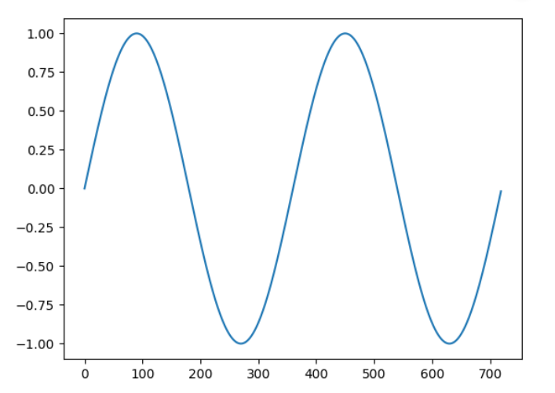
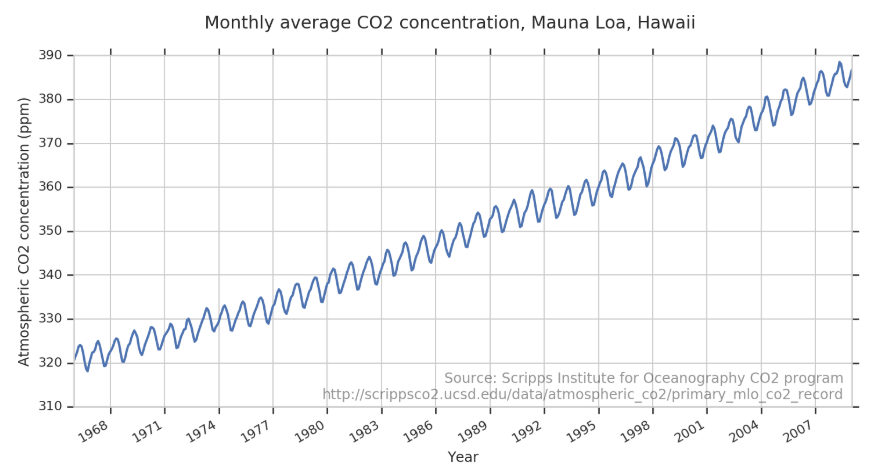
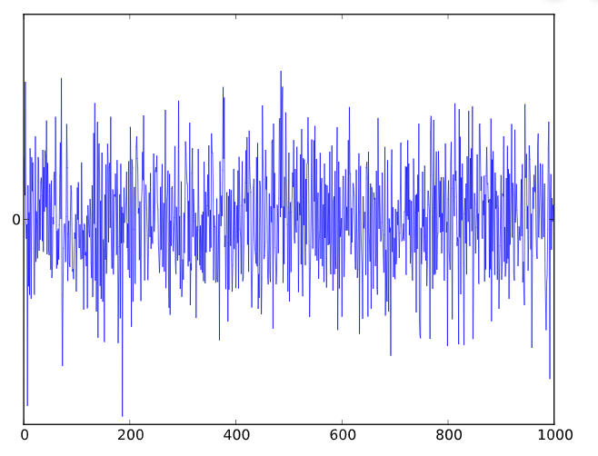
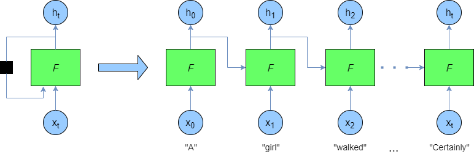

# Introduction to time series forecasting with deeplearning 

## What will we cover

[1. What is Forecasting](#1-what-is-forecasting)

[2. Goal of the session](#2-goal-of-the-session)

[3. Time series attributes](#3-time-series-attributes)

[4. Sequence Models](#4-sequence-models)

[5. Picking our data set](#5-picking-our-data-set)

[6. Prepare Data for input to Tensorflow model](#6-prepare-data-for-input-to-tensorflow-model)

[7. Design our Tensorflow model](#7-design-our-tensorflow-model)

[8. Putting it all together](#8-putting-it-all-together)

[9. Conclusion](#9-conclusion)

## 1. What is Forecasting

Forecasting, is the act of using historical data as an input to learn and make predictions about the direction of future trends. 
Formal definition if Y = {y1,y2, .... yn}then forecasting is finding the values of yn+h where h is the horizon of the forecast
It is important to keep in mind that it is important to know what type of forecasting you are trying to do  
**Univariate time Series:** where only one variable is changing over time, for example if we have a sensor recording temperature over time   
**Multivariate time series:** more than one variable is changing over time, for example accelerometer where X,Y and Z are recorded over time 

## 2. Goal of the session

Our goal is to show how can we build a deeplearning model to do forecasting of Multivariate time series?. I will not get in the discussion about deeplearning VS classical statistics for time series forecasting. Quick search will show that it is being debated even for univariate time series with papers supporting both sides, so i will leave that to you as a self reading after you finish the tutorial 

## 3. Time series Attributes

Before we jump into the Machine Learning aspect of this tutorial it is important to make sure we understand few basic attributes of time series  

**trend:** a systematic linear or nonlinear component that changes over time and does not repeat  

 

**Seasonality:** a systematic linear or nonlinear component that changes over time and repeat  

 

In real life data you will find both trend and seasonality together

 

**Noise:** non-systematic component that is neither trend nor seasonal

 

Typical time series will contain all three

 

## 4. Sequence Models

Time to start talk Machine Learning, In the previous sessions we did learn many types of Machine learning layers and models, like Neural Networks and Convolution Neural Networks (CNN). Time series will require us to learn a new type or Models which is called sequence models. The name almost till it all, in these models order does matter, because the data it is trying to learn are order sensitive. This is important in many applications for example in Natural Language Processing where the order or words affects how we understand the sentence, also in time series analysis without the correct order our analysis will be invalid.

The most basic type of sequence models is Recurrent Neural Networks, where the output of the previous step impact the out of the next step

The next diagram, show how the output of the previous step is fed into the next step

 

This is the base idea of sequence models, but we will not really use RNNs because there are cases where RNN will suffer. These cases are the ones where the output depends on context very early in the sequence. RNN can be adjust to handle cases like these but there is a nother type of network that can handle these cases much easier this type is Long Short Term Memory in short LSTM

**LSTM:**

LSTM are a variation of RNN, that deal specifically with the long-term dependency problem because it remember information for long time.

The details of how LSTMS works is beyond the scope of this tutorial and i suggest goign through the [amazing deeplearing specialization by Andrew NG](https://www.deeplearning.ai/deep-learning-specialization/) on coursera to get in the details (course 5) 

##5. Picking our data set
##6. Prepare Data for input to Tensorflow model
##7. Design our Tensorflow model
##8. Putting it all together
##9. Conclusion
