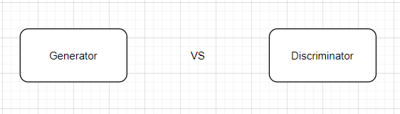
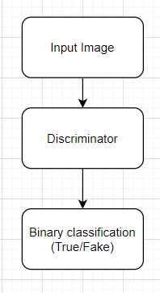
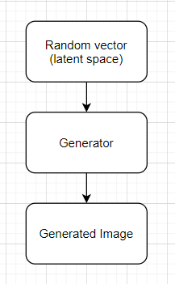
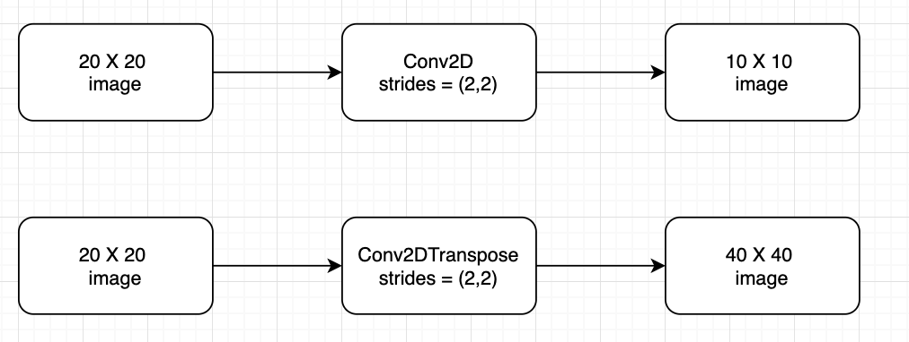
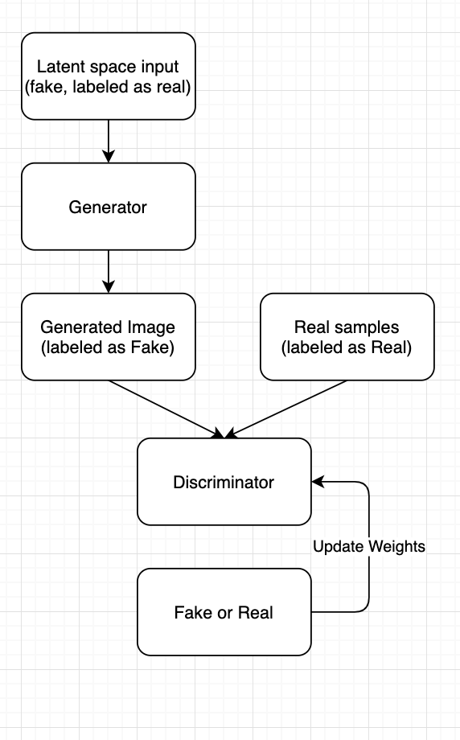
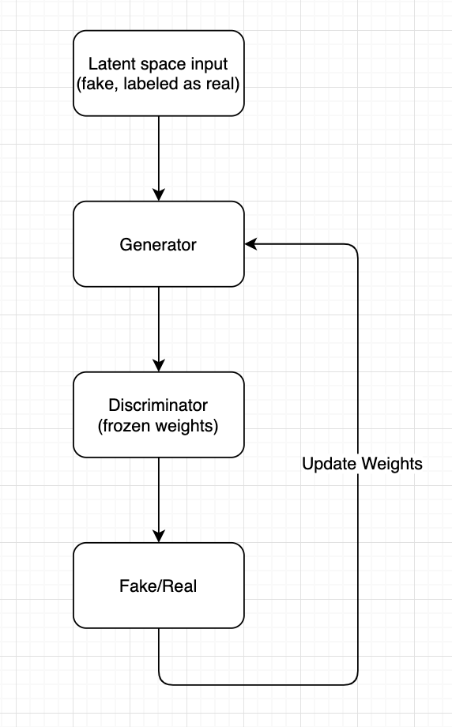
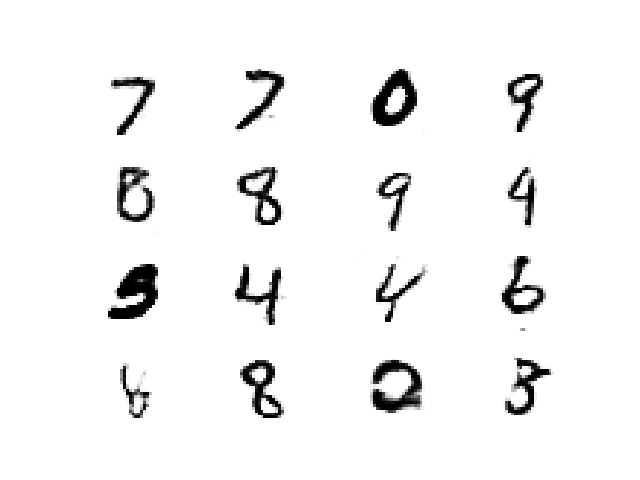

# Introduction to Generative Adversarial Networks

## What will we cover

[1. What is GAN](#1-what-is-gan)

[2. How to design a model to generate images](#2-how-to-design-a-model-to-generate-images)

[3. How to train GAN](#3-how-to-train-gan)

[4. GAN Tips and Tricks](#4-gan-tips-and-tricks)

[5. Generating hand written digits](#5-generating-hand-written-digits)

[6. Generating flower images](#6-generating-flower-images)

[7. Conditional GAN](#7-conditional-gan)

## 1. What is GAN

Generative Adversarial Networks, are machine learning models able to learn from existing images of a specific domain then generate new images based on the features it learned form the training images. GANs follow a zero-sum game in their training where you have 2 models almost fighting againest each other one is the discriminator model which try to learning how to detect the real images form the generated images, and a generator model which try to generate images with enough quality to trick the discriminator into thinking they are real.

It is a cop and thief game, where the thief is trying to confuse the cop and the cop is tryign to catch the thief. For example imagine a discriminator (cop) model, trained to detect images of money, while a generator (thief) is trying to generate fake money with enough quality to confuse the cop. Any time the discriminator detect the fake images as fake that is an indication for the generator that it needs to do better, and  vice versa. 

 

**Discriminator:**
The discriminator is typically a simple model architecture, and it will look svery similar to models we built in the previous sessions, it is just a classifier trained to take an image and classify it as real or fake.

 

**Generator:**
The generator responsibility is to generate images. It takes input which is a vector of random numbers (called latent space), and generate and image as output. We will get in the details of the Generator in later section

 

## 2. How to design a model to generate images

We have session in the previous sessions how to create classifiers using many different techniques. This covers the discriminator, But the generator is a new kind of a problem we did not face till now. 
Generator job is to receive a vector of random points as input and output a full image. So far when we dealt with images we have been using Conv2D layers to down sample an image to set of features, but here we want to do the opposite where we want to up-sample from a set of features to real image. There are different techniques to achieve that and Keras has a nice layer that we will be using extensively in this session to achieve the goal up sampling this layer is **Conv2DTranspose** this layer will learn how to up-sample during our training process as you will see in the next few sections.

One big difference between, **Conv2DTranspose** and **Conv2D** is the effect of the strides parameter, doe example if you set the strides parameter to (2,2) in **Conv2D** it will basically half the size of your image (an image of 20X20 will become 10X10) while in **Conv2DTranspose** it will double the size of the image (an image of 20X20 will become 40X40).

 

## 3. How to train GAN

As discussed in **[What is GAN](#1-what-is-gan)**, GAN actually consists of 2 models, the discriminator and the generator, and we are trying to train both at the same time and they affect each other, as a result GAN training is a bit more involved than the training we did in previous sessions.

Lets see what happens during one epoch while training GAN, during one epoch we need to update the weights of both the discriminator model and the generator model.  

**Discriminator update** :
  
We want to train a discriminator that will be able to classify images as real or fake, this means during one epoch a set of fake and real images will be passed to the discriminator and it will use these samples to classify them as real or fake meaning it will try to update the weights of the discriminator to produce the correct classifications. 
specific example, lets say we want to create a model able to generate paintings of trees, what we will need is to find a good data set of tree paintings (this will be our real samples), assume our samples size is 400 tree paintings, we need a similar number of fake images of tree paintings, How can we get these?. Well, this is where the generator comes into play, we create a set of 400 inputs for our generator, pass these through the generator, it will generate 400 fake tree paintings (it does not matter that the generator is not trained yet, we will see how it all connect shortly). Now we have 400 real tree paintings, and 400 fake tree painting, we label them as such then call the discriminator model to do one update (fit) using these samples (the 800 images), this will result in updating the discriminator weights to achieve the task of detecting the fake from the real images.

The following figure shows the Discriminator model training process:

 

**Generator update** :  
 
The Generator goal is a bit different, it is goal is to generate good enough images that the discriminator think they are real. During one epoch we updated the discriminator weights (as per previous section), then we need to update the generator weights too. the input to the generator is a vector or numbers (the latent space), so it is easy to randomly generate set of those, but we wnat the generator to generate realistic images that can confuse the discriminator, to do what we create a model where we stack the generator on top of the discriminator, this means that the output of the generator is passed to the discriminator. If we train this model to classify these fake images as real, it means it will update the weights in a way that make the generator generate real images, but there is a caveat here, the update will try to update both the discriminator and generator weights since they are in the same model, and this means we are messing up the training we did in the previous section, we just want to update the generator model weights in this step, this is easily fixable, we can do that by freezing the discriminator weights in this model, this way it will just update the generator weights which is exactly what we want.  

The following figure shows the GAN model used to train the generator:

 

## 4. GAN Tips and Tricks

GAN training as seen in **[How to train GAN](#3-how-to-train-gan)**, is quite involved. And a lot of the training process and parameters adjustment is a trial and error kind of approach. This being said, there are many successfully trained GAN models out there, and people shared their tips and tricks on how to train a GAN
Here few:  

* Use LeakyReLU instead or Relu for the activation of hidden layers with slope of 0.2
* Use gaussian weight initialization for the weights, using RandomNormal from Keras
* Use Adam optimizer with lr = 0.0002 and beta-1=0.5 but if your model suffer from model collapse (it starts to generate the same image from many inputs), lower the learning rate
* Scale your image input to [-1,1] instead of [0,1]
* Add noise to the training, by miss-labeling some samples (like 5%)
* Use label smoothing, so instead of using 1 for real use 0.8 to 1.0 and instead of using 0 for fake use 0 to 0.2
* when training the discriminator, do the training on 2 steps one patch with only fake and one patch with only real
* instead of using pooling layer in the discriminator, use stride of (2,2)
* consider using BatchNormilization layer before the activation (i got mixed result for this one)

These are just few tips and tricks, your results might be different and you should feel comfortable mixing and matching and changing the hyperparameters  
 
For full list [check out this NIPS 2016 session](https://github.com/mohmiim/ganhacks)   

## 5. Generating hand written digits

Time to have some fun :) , let's try to create a GAN capable of generating images for hand written digits. 

we will use the [mnist](http://yann.lecun.com/exdb/mnist/) data set to train our model, keras already have function to load this data set for you 

Let's define a function that will load the data, and scale it to [-1,1]  

~~~~{.python}
from numpy import expand_dims
from keras.datasets.mnist import load_data

def loadSamples():
  (trainX, _), (_, _) = load_data()
  # conv layer needs 3d array, so we will expand the dimensions
  X = expand_dims(trainX, axis=-1)
  X = X.astype('float32')
  # scale to [0,1]
  X = X / 255.0
  print(X.shape)
  return X
~~~~

this code, will load all the samples and scale the image data to [0,1], and print out the shape of the samples array
when you call this function you should get this output

~~~~{.python}
(60000, 28, 28, 1)
~~~~

which is correct since our samples are 60000 sample, and each one is 28*28 pixel

we will make our generator accept an input of 100 random numbers (latent space of size 100), let's create function that can generate any number of inputs in this latent space

~~~~{.python}
from numpy.random import randn

LATENT_DIM = 100

def generate_latent_input(latentDim, count):
  X = randn(latentDim * count)
  X = X.reshape((count,latentDim))
  X = X.astype('float32')
  return X
~~~~

We have a function that loads the real samples, and we have function that generate random input latent space, but we need a function to generate fake samples, lets create it 

~~~~{.python}
def create_generated_samples(generator, latentDim, count):
  X = generate_latent_input(latentDim, count)
  gen_images = generator.predict(X)
  # labels here will be fake ==> 0
  y = zeros((count,1))
  return gen_images, y
~~~~

We still need another utility function, when we train out model we train it using patches, so we need a function that return a patch for real samples. Lets create it 

~~~~{.python}
def generate_real_samples(dataset, n_samples):
  index = randint(0, dataset.shape[0], n_samples)
  X = dataset[index]
  # mark them as real
  y = ones((n_samples, 1))
  return X, y
~~~~

we are ready to create our first model, the discriminator. Discriminator contains convolution block that we will be repeating multiple times, so it is better to have a function that create this block since this will make our code much easier and much smaller

~~~~{.python}
from tensorflow.keras.layers import LeakyReLU
from tensorflow.keras.layers import Conv2D
from tensorflow.keras.initializers import RandomNormal 

DISC_FILTER_SIZE = 3
DISC_LEAKY_ALPHA = 0.2 

init = RandomNormal(stddev=0.02)

def createDiscConvLayer(model):
  model.add(Conv2D(64,
                   (DISC_FILTER_SIZE,DISC_FILTER_SIZE),
                   strides=(2, 2),
                   padding='same',
                   input_shape=INPUT_SIZE,
                   kernel_initializer=init))
  model.add(LeakyReLU(alpha=DISC_LEAKY_ALPHA))
  return model
~~~~

The createDiscConvLayer function does not really introduce any thing complex, it is just add a convolution layer, but it follow some of the tips and tricks we mentioned before. For example, it uses strides instead of pooling layers, it uses a Gaussian weight initializer and it uses leaky relu instead or relu for activation. Please note that I tried to make hyperparameters defined as constants outside the methods so we can play with them easily. 

Let's create our model:

~~~~{.python}
from tensorflow.keras.models import Sequential
from tensorflow.keras.layers import Dropout,Flatten
from tensorflow.keras.layers import Dense
from tensorflow.keras.optimizers import Adam

INPUT_SIZE = (28,28,1)
DISC_DROPOUT = 0.4
def create_discriminator(input_shape=INPUT_SIZE):
    print("Creating Discriminator")
    model = Sequential()
    # down sample to 14 X 14
    createDiscConvLayer(model)
    # down sample to 7 X 7
    createDiscConvLayer(model)

    model.add(Flatten())
    model.add(Dropout(DISC_DROPOUT))
    activation = 'sigmoid'
    loss= 'binary_crossentropy'
    model.add(Dense(1, activation=activation))
    # compile model
    opt = Adam(lr=0.0002, beta_1=0.5)
    model.compile(loss=loss, optimizer=opt, metrics=['accuracy'])
    print("Created Discriminator")
    model.summary()
    return model
~~~~

This model should look very familar, it is our typical binary classifier we implement using convolution, if you run this function you should see this output

~~~~{.python}
Creating Discriminator
Created Discriminator
Model: "sequential_3"
_________________________________________________________________
Layer (type)                 Output Shape              Param #   
=================================================================
conv2d_3 (Conv2D)            (None, 14, 14, 64)        640       
_________________________________________________________________
leaky_re_lu_5 (LeakyReLU)    (None, 14, 14, 64)        0         
_________________________________________________________________
conv2d_4 (Conv2D)            (None, 7, 7, 64)          36928     
_________________________________________________________________
leaky_re_lu_6 (LeakyReLU)    (None, 7, 7, 64)          0         
_________________________________________________________________
flatten_1 (Flatten)          (None, 3136)              0         
_________________________________________________________________
dropout_1 (Dropout)          (None, 3136)              0         
_________________________________________________________________
dense_2 (Dense)              (None, 1)                 3137      
=================================================================
Total params: 40,705
Trainable params: 40,705
Non-trainable params: 0
_________________________________________________________________
~~~~

We now have our discriminator, we need to create the generator. To make our life easier we will create a utility function that creates the upsampling block that we will reuse in our model

~~~~{.python}
from tensorflow.keras.layers import Conv2DTranspose

GEN_FILTER_SIZE = 4
GEN_LEAKY_ALPHA = 0.2

def addGenConvTransPoseLayer(model):
  model.add(Conv2DTranspose(128, (GEN_FILTER_SIZE,GEN_FILTER_SIZE),
                            strides=(2,2),
                            padding='same',
                            kernel_initializer=init))
  model.add(LeakyReLU(GEN_LEAKY_ALPHA))
~~~~

It is very similar to the function we created for the discriminator, but here we use Conv2DTranspose since we will be up-sampling

Then we create the generator itself

~~~~{.python}
from tensorflow.keras.layers import Reshape

def create_generator(latent_dim = LATENT_DIM):
    print("Creating Genertor")
    model = Sequential()
    # foundation for 7*7 image
    n_nodes = 128 * 7 * 7
    model.add(Dense(n_nodes, input_dim=latent_dim))
    model.add(LeakyReLU(alpha=GEN_LEAKY_ALPHA))
    model.add(Reshape((7, 7, 128)))
    # upsample to 14 * 14
    addGenConvTransPoseLayer(model)
    # upsample to 28*28
    addGenConvTransPoseLayer(model)
    # output layer
    model.add(Conv2D(1, (7,7),
                     activation='sigmoid',
                     padding='same',
                     kernel_initializer=init))
    print("Created Generator")
    model.summary()
    return model

~~~~

This code, will be basically the opposite of the convolution model for classification, one important point is to make sure that the output of this model matches the shape of the input images to the discriminator

if you run this method, you should get

~~~~{.python}
Creating Genertor
Created Generator
Model: "sequential_4"
_________________________________________________________________
Layer (type)                 Output Shape              Param #   
=================================================================
dense_3 (Dense)              (None, 6272)              633472    
_________________________________________________________________
leaky_re_lu_7 (LeakyReLU)    (None, 6272)              0         
_________________________________________________________________
reshape_1 (Reshape)          (None, 7, 7, 128)         0         
_________________________________________________________________
conv2d_transpose_2 (Conv2DTr (None, 14, 14, 128)       262272    
_________________________________________________________________
leaky_re_lu_8 (LeakyReLU)    (None, 14, 14, 128)       0         
_________________________________________________________________
conv2d_transpose_3 (Conv2DTr (None, 28, 28, 128)       262272    
_________________________________________________________________
leaky_re_lu_9 (LeakyReLU)    (None, 28, 28, 128)       0         
_________________________________________________________________
conv2d_5 (Conv2D)            (None, 28, 28, 1)         6273      
=================================================================
Total params: 1,164,289
Trainable params: 1,164,289
Non-trainable params: 0
_________________________________________________________________
~~~~

Note that the output of the generator model is (28,28,1) which matches the inout of the discriminator model

We have now our Discriminator model, and our Generator model, lets create the GAN model that we will use to train the generator

~~~~{.python}
def create_gan(generator, discriminator):
  print("Creating GAN")
  # freeze the weights of the discriminator
  discriminator.trainable = False
  # connect them
  model = Sequential()
  # add generator
  model.add(generator)
  # add the discriminator
  model.add(discriminator)
  # compile model
  opt = Adam(lr=0.0002, beta_1=0.5)
  loss= 'binary_crossentropy'
  model.compile(loss=loss, optimizer=opt)
  print("Created GAN")
  model.summary()
return model
~~~~

if you run this code you should get the following output

~~~~{.python}
Creating GAN
Created GAN
Model: "sequential_5"
_________________________________________________________________
Layer (type)                 Output Shape              Param #   
=================================================================
sequential_4 (Sequential)    (None, 28, 28, 1)         1164289   
_________________________________________________________________
sequential_3 (Sequential)    (None, 1)                 40705     
=================================================================
Total params: 1,204,994
Trainable params: 1,164,289
Non-trainable params: 40,705
_________________________________________________________________
~~~~

Now we are ready to write our training function, our implementation will follow the exact steps mentioned in  **[How to train GAN](#3-how-to-train-gan)**

~~~~{.python}
import math

def train(generator, discriminator, gan, dataset, latent_dim, n_epochs0, n_batch=256):
  batches_count = math.ceil(dataset.shape[0] / n_batch)
  half_batch = int(n_batch / 2)
  # manually enumerate epochs
  for i in range(n_epochs):
    # enumerate batches over the training set
    print('>Epoch:%d' % (i+1), end = " ")
    for j in range(batches_count):
      # get randomly selected 'real' samples
      X_real, y_real = generate_real_samples(dataset, n_batch)
      # generate 'fake' examples
      X_fake, y_fake = create_generated_samples(generator, latent_dim, half_batch)
      # update discriminator model weights
      lossReal, _ = discriminator.train_on_batch(X_real, y_real)
      lossFake, _ = discriminator.train_on_batch(X_fake, y_fake)
      # prepare points in latent space as input for the generator
      X_gan = generate_latent_input(latent_dim, n_batch)
      # mark fake as real
      y_gan = ones((n_batch, 1))
      # update the generator via the discriminator's error
      loss_generator = gan.train_on_batch(X_gan, y_gan)
      print(".", end="")
      # summarize loss on this batch
    if i%10 == 0 :
      generateSampleOutput(i+1,generator,4)
~~~~

Our training function, calls a utility method every 10 epochs to save sample output of our generator 

Now we have every thing we need to create the model, load the sample and start the training. Let's put it together

~~~~{.python}
dataset  = loadSamples()

# create the discriminator
discriminator = create_discriminator()
# create the generator
generator = create_generator(LATENT_DIM)
# create the gan
gan = create_gan(generator, discriminator)

# train model
train(generator, discriminator, gan, dataset, LATENT_DIM)
~~~~

That is it, now you have a model that can generate numbers

here is sample output

 

This **[Notebook](https://github.com/mohmiim/MLIntroduction/blob/master/session-7/generate_numbers.ipynb)** has the full working code, try to play with it and see if you can make it better

## 6. Generating flower images

## 7. Conditional GAN
