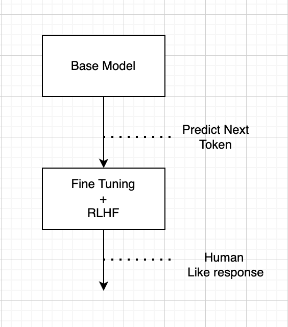
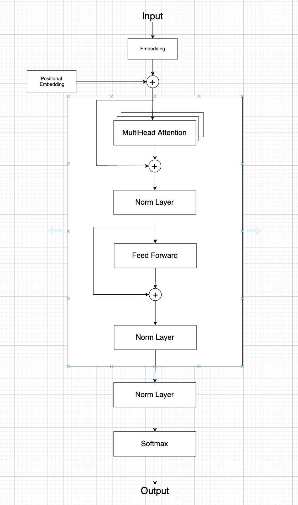
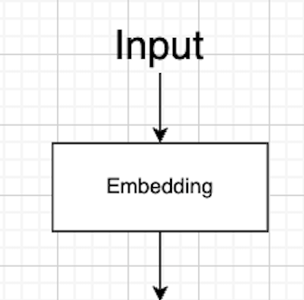
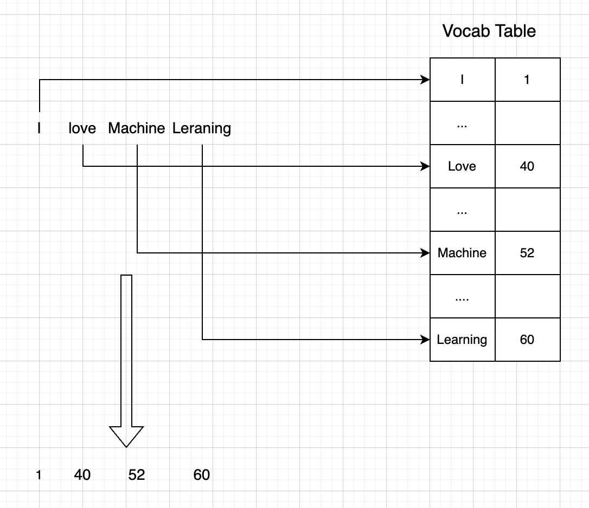

# What are LLM models and how they are designed and trained

In this session, we will cover the concept of LLM models and how they are designed and trained. I am not planning to cover Prompt engineering in this session.

LLM stands for Large Language Model, and it is a model that is trained to predict the next word in a sentence. The model is trained on a large corpus of text, and it is designed to be able to generate text that is similar to the text it was trained on.

The large amount of training data, and the large number of parameters in the model allow it to discover relationships from the text that are not explicitly stated in the training data. This allows the model to generate text that is coherent and relevant to the input text. The training process
is both unsupervised and semi supervised.

Large language model uses exciting very well know techniques in deeplearning (and we covered some of them in previous sessions) like Neural networks, Transformer architecture and so pn

## How large is large

We can not underestimate the L in LLM models, the size of the model is what makes it powerful, and it is what makes it hard to train. The model has billions of parameters, and it requires a lot of computational resources to train. But also require powerful GPU and lots of memory at inference time

here are some examples of some LLM models sizes

<table style="width:100%; border: 1px solid black;">
  <thead>
    <tr>
      <th style="text-align:left;">Model</th>
      <th style="text-align:right;">Number of Parameters</th>
    </tr>
  </thead>
  <tbody>
    <tr>
      <td style="text-align:left;">GPT 3</td>
      <td style="text-align:right;">175 Billion</td>
    </tr>
    <tr>
      <td style="text-align:left;">LLama 3.2 </td>
      <td style="text-align:right;">up to 90 Billion</td>
    </tr>
  </tbody>
</table>

## Transformer architecture

To understand  the inner works of LLM models, we need to understand the transformer architecture, and how it is used in LLM models. The transformer
architecture is a type of neural network that is designed to process sequences of data. It is made up of two main components: the encoder and the decoder. 
The encoder takes the input sequence and processes it to create a representation of the input data. The decoder takes the representation created by the 
encoder and uses it to generate the output sequence. It all started with the amazing paper "Attention is all you need" by Vaswani et al. in 2017. here 
is a link for it [Attention is all you need](https://arxiv.org/abs/1706.03762)

In this Session we will delve into the transformer architecture and how it is used in LLM models.

## Is it really smart

Well, it depends :) 
Typically we used to train what i would call a base model that gets really good at predicting the next word in a sentence, but it
is not very good at understanding the context of the sentence and does not operate in an assistance kind of a way.
So, how cna we deal with that and how can we make it look smart and act like a human here comes RLHF (Reinforcement Learning from Human Feedback)

That is a mouth Full, but it is a technique that is used to train the model to generate text that is more coherent and relevant to the input text
and sounds like a human responding to your input.

Think about it as 2 blocks of training, the first block is the base model that is trained to predict the next word in a sentence, and the second
block is the RLHF block that is trained to generate text that is more coherent and relevant to the input text.

This a Visualization of the simplified flow we are talking about
<p align="center"> 

</p>

## Recap

We design a BaseModel that uses transformer architecture. Then we train it on a large corpus of text to predict, Then we
get to the fine tuning part, where we create a data set that capture alot of Q&A from human conversation and use that to
fine tune the model which will make the model start to respond as a human rather than just sentence completions.

### RLHF (Reinforcement Learning from Human Feedback)
All, this being done we move to the RLHF step, where we would like the model to learn from human feedback, a simplified
flow for this might look like this:

- For a specific prompt get the model responses.
- A human rank the responses
- This data is used to train a Reward model
- A policy is optimised against the reward model using PPO (Proximal Policy Optimization, it is used to train the agent's decision Fn) RL algorithm
- A new prompt is sampled
- The PPO model is initialized using the trained policy
- The policy is used to generate output
- The Reward model is used to calculate the Reward
- The reward is used to update the policy using PPO

This is a very high-level overview of how RLHF works, and there are many details that are not covered here. But this should give you a good idea of how it works.

## How to train LLM models and what is the Architecture

The training process for LLM models is a complex and time-consuming process. It requires a large amount of training 
data, a large amount of computational resources, and a lot of time. The training process typically takes several weeks
to complete.

The next diagram shows in a high level the typical model architecture

<p align="center"> 

</p>

I find the best way to get better understanding of a model, is to go through the architecture diagram piece by piece and 
try to digest it is one piece ata a time.

### we will start with the embedding block:

<p align="center"> 

</p>

Machine learning models can not work with text directly, so we need to convert the text into a numerical representation
that the model can work with. This is done using an embedding layer. The embedding layer takes the input text and
converts it into a vector of numbers that represents the text. 

The Question now is how can we convert a word to embedding vector, that represents it well in other words a vector that
captures the essence of the word. We can train the model to learn the best representation 

Think about a word as a point in a high-dimensional space, where each dimension represents a different aspect of the 
word. The embedding layer learns to map the word to a point in this space that captures the meaning of the word.

WE can include the embedding layer in the model, and train it along with the rest of the model. Like this 

```python
import tensorflow as tf
from tensorflow.keras.layers import Embedding
from tensorflow.keras.models import Sequential

model = Sequential()
model.add(Embedding(input_dim=10000, output_dim=15, input_length=100))
......
model.compile('adam', 'mse')
model.summary()
```

But we can also use pre-trained embeddings, like GloVe, Word2Vec, Bert, or FastText. These embeddings are trained on a 
large corpus of text and capture the meaning of words in a way that is useful for many different tasks. 
We can use these pre-trained embeddings as the initial weights for the embedding layer in our model. Like this

Ok, this is all good but let's go a bit more deeper and see how this works

Embedding is still an ML layer, so its input can not be just text it has to be a number. We need to 
convert the text to a number, this is done using a tokenizer. The tokenizer takes the text and converts it into a 
set of numbers a very simple one could be just to convert each word to a number, using a simple dictionary typically 
referred to as the vocab table, where each word is mapped to a number.

for example, the sentence "I love machine learning" could be converted to [1, 40, 52, 60] where 1 is the number for "I",
40 is the number for "love", 52 is the number for "machine", and 60 is the number for "learning".

<p align="center"> 

</p>

A fantastic tool that can help you understand embedding visually and how words are clustered is [Tensorflow projector](https://projector.tensorflow.org/)  

### The Positional Embedding block